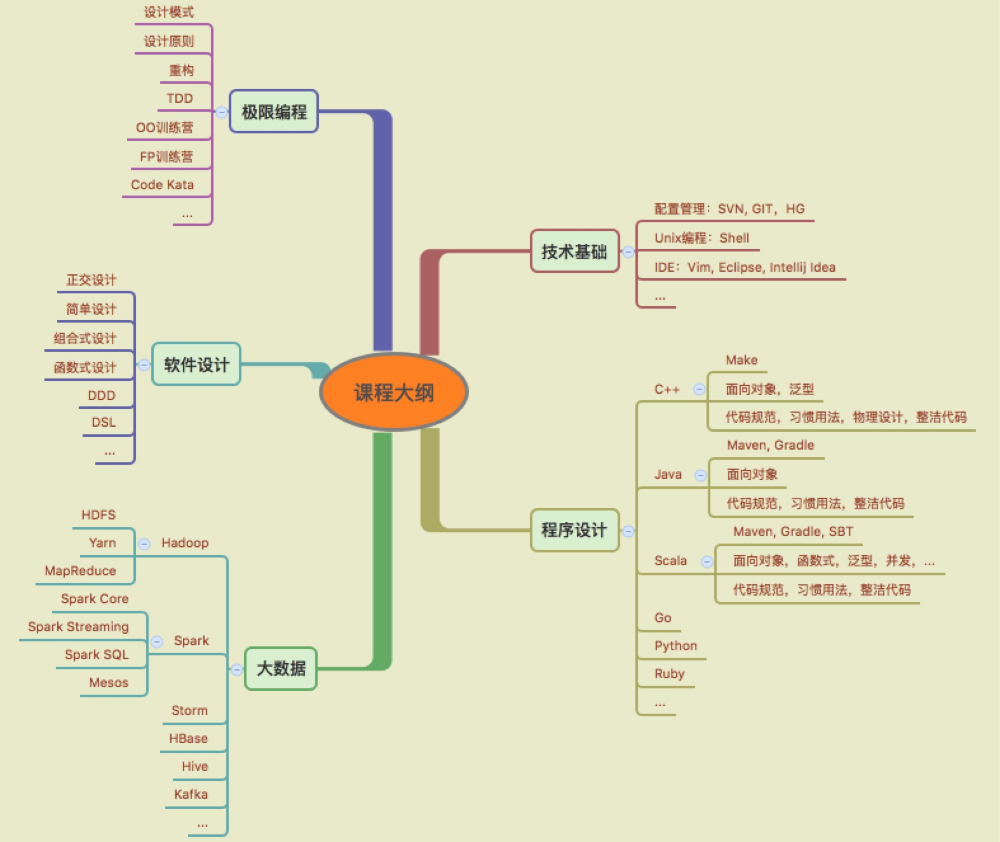

# 米修：一家专注于软件设计与定制的卓越企业

## 公司简介

「米修」是一家专注于软件设计与定制的卓越企业，由一批富有激情的软件专家组成，他们曾服务于IBM，ThoughtWorks，阿里，华为，中兴等国内外知名企业，他们拥有敏锐的行业发展的洞察力，及其丰富的大规模系统软件的开发经验。

我们致力于先进的软件开发过程，积极关注当前炙手可热的技术；我们与国内各大企业建立了长期的战略合作协议，积极搭建大学生与企业之间的桥梁，为企业输送最优秀的技术人才。

## 使命

软件改变世界，程序改变人生

## 业务

- 技术培训与指导
- 技术咨询与服务
- 软件开发与定制

## 关注领域

- 大数据
- 云计算

## 培养计划

- Hadoop工程师
- Spark工程师

## 总体设计

## 社区贡献

「米修」曾多次组织了Code Kata，Code Retreat等软件设计的线上线下活动，激发程序员对软件设计永无止境的追求；我们积极关注C++11，Java8，Scala，Go，Ruby等程序设计语言的最佳实践，积极推动社区发展；我们积极关注Docker，Spark，Mesos，Yarn等社区发展的动态，并成为社区的布道者和先行者。

## 人才储备

### 刘光聪

刘光聪，「米修」创始人，敏捷教练，开源软件爱好者，具有多年大型遗留系统的重构经验，对`OO`, `FP`, `DSL`等领域具有浓厚的兴趣。

### 王博

王博，「米修」创始人，敏捷教练。

